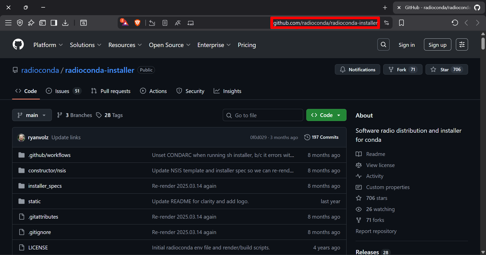
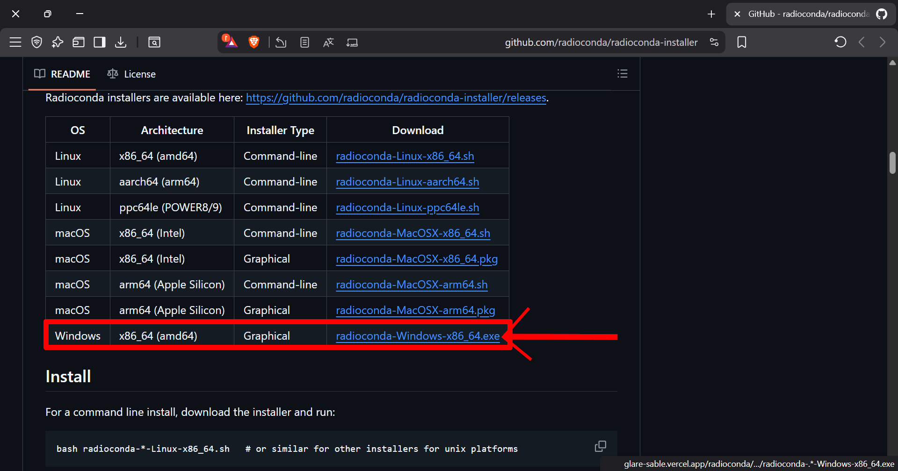
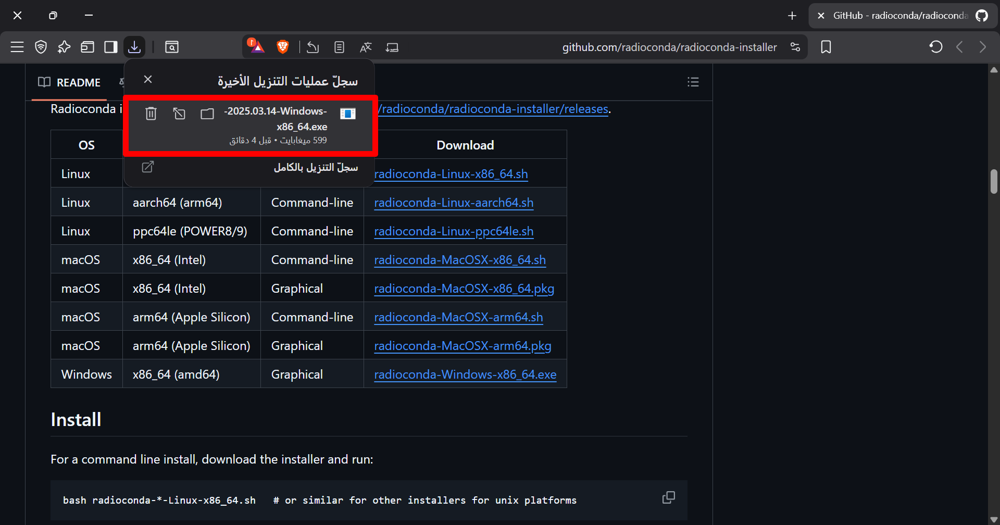
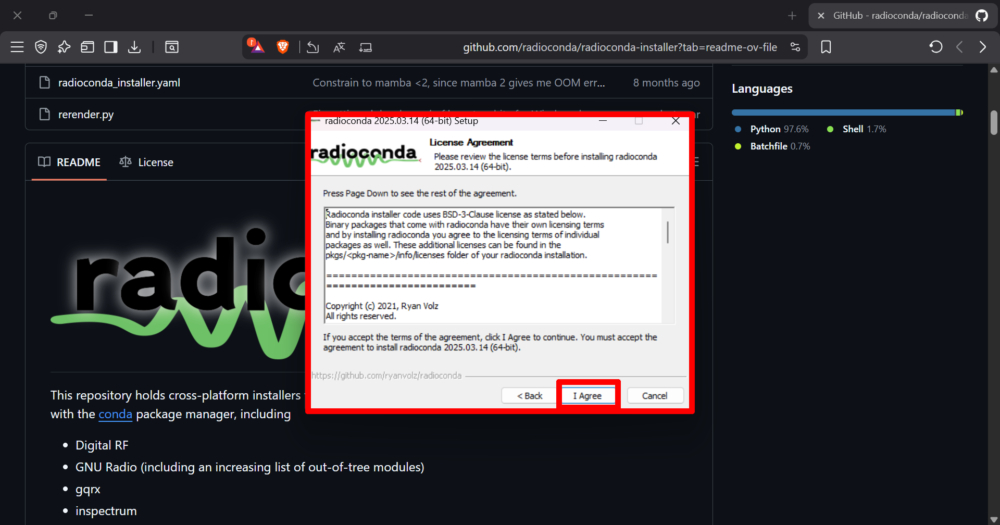
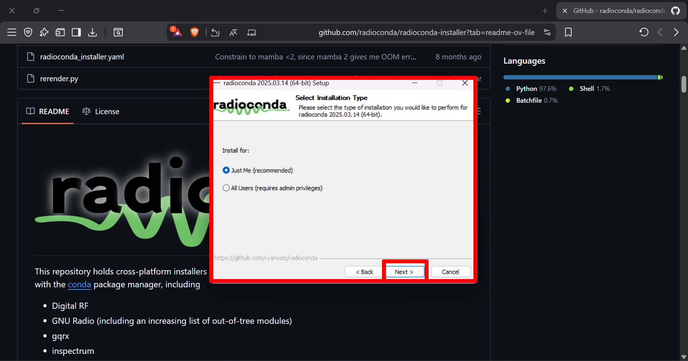
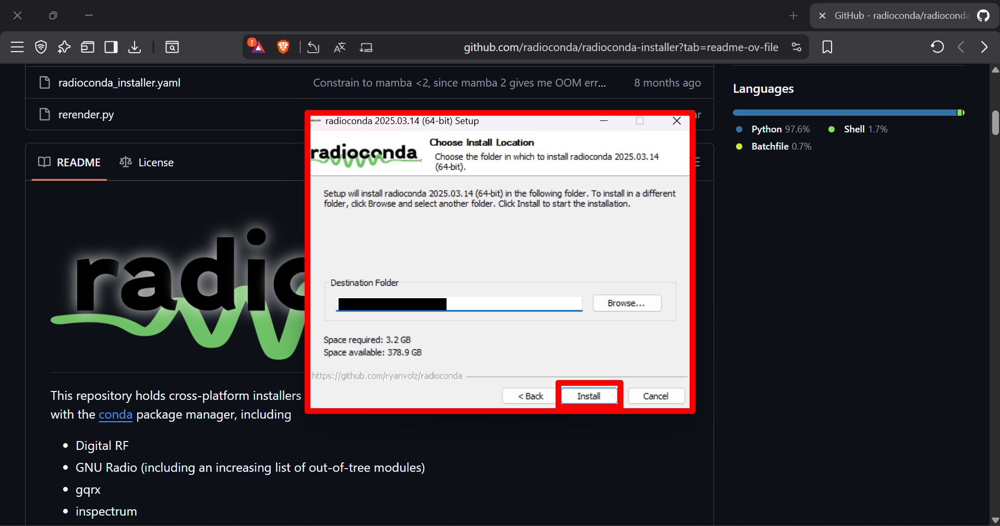
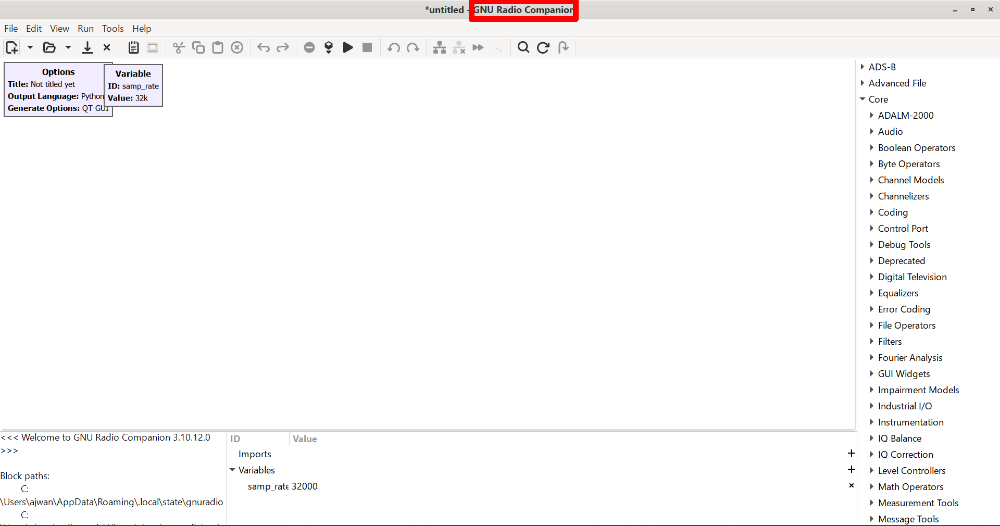

# GNU Radio Installation Guide for Windows (04/11/2025)
### A beginner-friendly guide to installing GNU Radio on *Windows* systems.

1. Go to the following GitHub repository: [radioconda-installer](https://github.com/radioconda/radioconda-installer)
   

2. Scroll down until you see the [**Download**](https://github.com/radioconda/radioconda-installer?tab=readme-ov-file#download) section, then download **radioconda-Windows-x86_64.exe**.
   

3. Open the downloaded file.
   

4. Click **Next**.
   

5. Agree to the license agreement.
   

6. Click **Next** again.
   

7. Change the installation directory (optional) or leave it as default, then click **Install**.
   

8. Wait for the installation process to finish — and you’re done! Now, search for **GNU Radio Companion** in your Start menu.
   

---
   
## Enjoy Learning!

To learn more, check the following website:
👉 [GNU Radio Tutorials Page](https://wiki.gnuradio.org/index.php?title=Tutorials)
